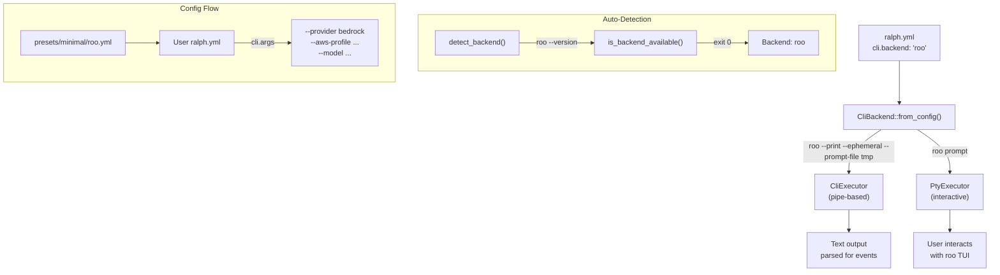

# Detailed Design: Add roo-cli as a Provider

## Overview

This design adds Roo Code CLI (`roo`) as a new backend provider in ralph-orchestrator, following the same adapter pattern used by kiro, claude, gemini, and other existing backends. The integration uses **text mode** (plain stdout capture) for simplicity and reliability, with `--prompt-file` for prompt passing.

Roo is an AI coding assistant CLI (v0.1.15+) that supports multiple LLM providers (Anthropic, OpenAI, AWS Bedrock, OpenRouter, etc.) and features tool auto-approval by default, making it well-suited for Ralph's autonomous loop.

## Detailed Requirements

### Functional Requirements

1. **Headless execution**: `roo --print --ephemeral --prompt-file <path>` runs roo in non-interactive mode with clean disk state, reads prompt from file, executes, and exits
2. **Interactive execution**: `roo "prompt"` launches roo's TUI for `ralph plan` use
3. **Extra args passthrough**: Users configure model, provider, AWS flags via `cli.args` in ralph.yml
4. **Auto-detection**: `roo --version` checks if roo is available in PATH
5. **Preset file**: `presets/minimal/roo.yml` provides a ready-to-use configuration

### Non-Functional Requirements

1. **Text output format**: Plain text capture (like kiro, gemini, codex)
2. **Pipe mode**: `pty_mode: false` for clean output without ANSI codes
3. **Standard error handling**: Exit codes + event tags + LOOP_COMPLETE token
4. **No roo-specific parsing**: No custom error detection or output processing

## Out of Scope

- **Stream-JSON support**: Roo's `--output-format stream-json` provides structured NDJSON with cost/token tracking. Deferred to future enhancement.
- **`--ephemeral` issue**: Previously broke Bedrock authentication, now fixed in roo v0.1.15+. Included in defaults.
- **Roo mode integration**: Ralph hats don't map to roo `--mode` flags. Users configure via `cli.args`.
- **Custom RooStreamParser**: Not needed for text mode. Required only if stream-json is added later.
- **Roo session management**: No `--continue` or `--session-id` usage. Each iteration is a fresh invocation.

## Architecture Overview



## Components and Interfaces

### 1. Backend Definition (`cli_backend.rs`)

Two new methods on `CliBackend`:

#### `roo()` — Headless mode
```rust
pub fn roo() -> Self {
    Self {
        command: "roo".to_string(),
        args: vec!["--print".to_string(), "--ephemeral".to_string()],
        prompt_mode: PromptMode::Arg,      // Uses --prompt-file in build_command
        prompt_flag: None,                  // Positional prompt (small) or --prompt-file (large)
        output_format: OutputFormat::Text,
        env_vars: vec![],
    }
}
```

#### `roo_interactive()` — Interactive mode
```rust
pub fn roo_interactive() -> Self {
    Self {
        command: "roo".to_string(),
        args: vec![],
        prompt_mode: PromptMode::Arg,
        prompt_flag: None,                  // Positional prompt
        output_format: OutputFormat::Text,
        env_vars: vec![],
    }
}
```

### 2. Prompt Handling via `--prompt-file` (`build_command()`)

Roo natively supports `--prompt-file <path>`. **All roo prompts** are passed via `--prompt-file` (not positional args). This is simpler than conditional logic — one code path, no size threshold, verified working for both small and large prompts.

`build_command()` will:
1. Write prompt to a `NamedTempFile`
2. Add `--prompt-file <path>` to args (no positional prompt)
3. Return the temp file handle to keep it alive during execution

```rust
// In build_command() for roo:
if self.command == "roo" {
    // Always write prompt to temp file and use --prompt-file
    match NamedTempFile::new() {
        Ok(mut file) => {
            file.write_all(prompt.as_bytes())?;
            args.push("--prompt-file".to_string());
            args.push(file.path().display().to_string());
            (None, Some(file))
        }
        Err(_) => {
            // Fallback to positional arg if temp file fails
            args.push(prompt.to_string());
            (None, None)
        }
    }
}
```

This is cleaner than Claude's workaround (which writes a temp file and tells the agent "please read file X"). Roo reads the file directly as a native CLI feature.

### 3. Registration Points

| Location | Change |
|----------|--------|
| `from_config()` | Add `"roo" => Self::roo()` match arm |
| `from_name()` | Add `"roo" => Ok(Self::roo())` match arm |
| `for_interactive_prompt()` | Add `"roo" => Ok(Self::roo_interactive())` match arm |
| `filter_args_for_interactive()` | Add `"roo"` arm that removes `--print` and `--ephemeral` |

### 4. Auto-Detection (`auto_detect.rs`)

| Change | Value |
|--------|-------|
| `DEFAULT_PRIORITY` | Append `"roo"` at end |
| `detection_command("roo")` | Returns `"roo"` (no mapping needed, unlike kiro→kiro-cli) |
| `NoBackendError` display | Add `"• Roo CLI: https://github.com/RooVetGit/Roo-Code"` |

### 5. Preset File (`presets/minimal/roo.yml`)

Mirrors the kiro preset pattern:

```yaml
# Ralph Orchestrator Configuration for Roo Code CLI
# v2 nested format - optimized for Roo CLI

# Event loop settings
event_loop:
  completion_promise: "LOOP_COMPLETE"
  max_iterations: 100
  max_runtime_seconds: 14400      # 4 hours
  max_consecutive_failures: 5

# CLI backend settings
cli:
  backend: "roo"
  prompt_mode: "arg"
  pty_mode: false
  pty_interactive: true
  idle_timeout_secs: 30

# Core behaviors
core:
  specs_dir: "./specs/"
  guardrails:
    - "Fresh context each iteration - save learnings to memories for next time"
    - "Don't assume 'not implemented' - search first"
    - "Verification is mandatory - tests/typecheck/lint/audit must pass"
    - "Confidence protocol: score decisions 0-100. >80 proceed autonomously; 50-80 proceed + document; <50 choose safe default + document."

hats:
  builder:
    name: "Builder"
    description: "Implements code, creates files, runs tests. Does the actual work."
    triggers: ["build.task"]
    publishes: ["build.done", "build.blocked"]
    instructions: |
      ## WORKFLOW
      You are Builder. Your job is to IMPLEMENT - write code, create files, run tests.
      1. Read the build.task event payload - that's your task
      2. IMPLEMENT: Create files, write code, run commands
      3. VERIFY: Run tests/builds to confirm it works
      4. COMPLETE: Emit build.done when verified, or build.blocked if stuck
      RULES:
      - Do the actual work - don't just plan or delegate
      - Never emit build.task (that's for coordination, not you)
```

## Data Models

No new data models needed. The existing `CliBackend`, `OutputFormat`, `PromptMode`, and `HatBackend` types are sufficient.

## Error Handling

Standard Ralph error handling applies with one important caveat:

Roo's exit code behavior varies by error type (verified via live testing):

| Error Type | Exit Code | Behavior |
|-----------|-----------|----------|
| **Config error** (invalid provider) | **1** | Exits immediately |
| **API auth error** (invalid key) | **Never exits** | Retries indefinitely, `--exit-on-error` doesn't stop retries |
| **Success** | **0** | Exits normally |

Ralph's error detection handles all cases:

- **Config errors** → Non-zero exit code → Ralph detects failure immediately
- **API auth errors** → Roo retries indefinitely → Ralph's **idle timeout** kills the process → counted as failure
- **No events emitted** → Consecutive failure counter increments (primary detection)
- **LOOP_COMPLETE not found** → Loop continues to next iteration, failure counter increments
- **Max consecutive failures** → Loop terminates after N iterations without events

No roo-specific error detection or parsing needed.

## Testing Strategy

### Unit Tests (in `cli_backend.rs`)

| Test | Validates |
|------|-----------|
| `test_roo_backend` | `roo()` produces `roo --print --ephemeral --prompt-file <path>` |
| `test_roo_interactive` | `roo_interactive()` produces `roo "prompt"` |
| `test_from_name_roo` | `from_name("roo")` returns correct backend |
| `test_from_config_roo` | Config `backend: "roo"` creates correct backend |
| `test_from_config_roo_with_args` | Extra args (model, provider) are appended |
| `test_for_interactive_prompt_roo` | Interactive factory returns `roo_interactive()` |
| `test_roo_interactive_mode_removes_print` | `build_command("prompt", true)` removes `--print` and `--ephemeral` |

### Unit Tests (in `auto_detect.rs`)

| Test | Validates |
|------|-----------|
| `test_detection_command_roo` | `detection_command("roo")` returns `"roo"` |
| `test_default_priority_includes_roo` | "roo" in `DEFAULT_PRIORITY` |
| `test_default_priority_roo_is_last` | "roo" is last in priority |

### Integration Test (manual)

```bash
# Verify roo backend works end-to-end
ralph run -b roo -- --provider bedrock --aws-profile roo-bedrock \
  --aws-region us-east-1 --model anthropic.claude-sonnet-4-6 \
  --max-tokens 64000 -p "Create a hello.txt file with 'Hello World'"
```

## Key Learnings (verified via live testing)

1. **Conversation history clears between iterations** — Each `roo --print` is a fresh process. Second invocation reports "I have no memory of previous conversations."
2. **`--ephemeral` now works with Bedrock** — Fixed in roo v0.1.15+. Previously broke Bedrock auth by using temp dir that lost provider settings.
3. **Tool auto-approval is roo's default** — No `--trust-all-tools` equivalent needed. File write/read executed without any approval flag.
4. **`--prompt-file` is native** — Verified working with 7530-char prompt. Cleaner than Claude's temp-file workaround.
5. **Roo exit codes are nuanced** — Config errors exit 1 ✅. API auth errors cause infinite retry (never exits) — Ralph's idle timeout handles this. Success exits 0 ✅.
6. **Event tags work with proper context** — Roo refuses bare "output this text" prompts as injection attacks, but cooperates when event protocol is part of system instructions (as Ralph provides).
7. **Roo outputs `[task complete]`** — Not parsed by Ralph, but useful for debugging.

## Appendices

### Technology Choices

| Choice | Rationale |
|--------|-----------|
| Text mode | Simple, proven (6/9 providers use it), no parser needed |
| `--prompt-file` | Native roo support, cleaner than positional args for large prompts |
| Pipe mode | Clean output, no ANSI codes, easier event parsing |
| `--ephemeral` included | Clean disk state, fixed in roo v0.1.15+ to work with Bedrock |

### Alternative Approaches Considered

1. **Stream-JSON mode**: Would provide cost tracking, token usage, tool-use visibility. Deferred due to: (a) roo's format is different from Claude/Pi requiring a new parser, (b) roo CLI is still evolving (v0.1.15), (c) text mode is proven and sufficient.

2. **No `--ephemeral`**: Initially considered because `--ephemeral` broke Bedrock auth. Now fixed in roo v0.1.15+, so `--ephemeral` is included by default for clean disk state.

3. **Roo mode mapping**: Ralph hats → roo `--mode`. Rejected as over-engineering; users can set `--mode` via `cli.args` if needed.

4. **Custom roo mode for Ralph**: Creating a dedicated roo mode with Ralph-specific system instructions. Rejected — roo's default "code" mode provides all necessary tool groups and its system prompt complements Ralph's user prompt.

### Research References

- [roo CLI interface research](./../research/roo-cli-interface.md)
- [Ralph adapter system research](./../research/ralph-adapter-system.md)  
- [Text vs stream-json analysis](./../research/text-vs-stream-json.md)
