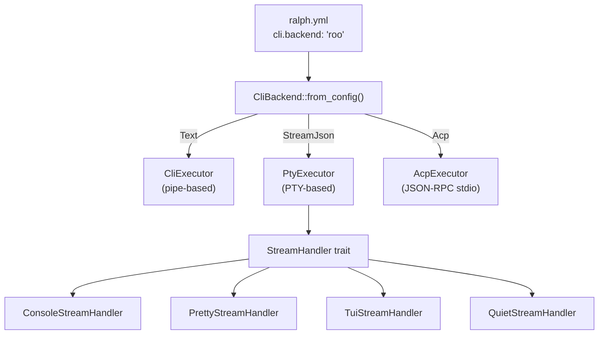

# Research: Ralph Adapter System (Existing Codebase)

## Architecture Overview

Ralph supports multiple CLI backends through a layered adapter system:



## Key Files to Modify

| File | Purpose | What to Add |
|------|---------|-------------|
| `crates/ralph-adapters/src/cli_backend.rs` | Backend definitions | `roo()`, `roo_interactive()` methods |
| `crates/ralph-adapters/src/auto_detect.rs` | PATH detection | Add "roo" to `DEFAULT_PRIORITY`, `detection_command()` |
| `crates/ralph-adapters/src/pty_executor.rs` | PTY streaming | Add roo stream format handling |
| `presets/minimal/roo.yml` | Preset config | New preset file |

## Backend Registration Points

A new backend must be registered in these locations in `cli_backend.rs`:

1. **`from_config()`** — Maps config string to backend constructor (line 69-81)
2. **`from_name()`** — Maps name string to backend (line 235-248)
3. **`from_hat_backend()`** — Maps HatBackend enum variant (line 254-280)
4. **`for_interactive_prompt()`** — Interactive mode factory (line 388-399)

## Output Format Dispatch

The `OutputFormat` enum (4 variants) determines execution strategy:

| Format | Executor | Parser | Used By |
|--------|----------|--------|---------|
| `Text` | CliExecutor or PtyExecutor | Raw text | kiro, gemini, codex, amp, copilot, opencode |
| `StreamJson` | PtyExecutor | `ClaudeStreamParser` | claude |
| `PiStreamJson` | PtyExecutor | `PiStreamParser` | pi |
| `Acp` | `AcpExecutor` | JSON-RPC handler | kiro-acp |

## Auto-Detection System

- `DEFAULT_PRIORITY`: `["claude", "kiro", "kiro-acp", "gemini", "codex", "amp", "copilot", "opencode", "pi"]`
- `detection_command()` maps backend names to CLI binaries (e.g., "kiro" → "kiro-cli")
- Detection runs `<command> --version` and checks exit code 0

## Preset File Pattern (from `presets/minimal/kiro.yml`)

```yaml
event_loop:
  completion_promise: "LOOP_COMPLETE"
  max_iterations: 100
  max_runtime_seconds: 14400
  max_consecutive_failures: 5

cli:
  backend: "kiro"
  prompt_mode: "arg"
  pty_mode: false
  pty_interactive: true
  idle_timeout_secs: 30

core:
  specs_dir: "./specs/"
  guardrails:
    - "Fresh context each iteration..."
    - ...

hats:
  builder:
    name: "Builder"
    ...
```

## HatBackend Enum

From `ralph-core`, the `HatBackend` enum supports:
- `Named(String)` — Simple named backend
- `NamedWithArgs { backend_type, args }` — Named with extra CLI args
- `KiroAgent { backend_type, agent, args }` — Kiro-specific agent selection
- `Custom { command, args }` — Fully custom command

## Stream Parser Integration

For **text-mode** backends (like kiro), no stream parser is needed — raw stdout is captured.

For **stream-json** backends (like claude), `ClaudeStreamParser` processes NDJSON events into `StreamHandler` calls.

For **pi**, `PiStreamParser` does the same with Pi's NDJSON format.

Roo's stream-json format is **different from both Claude and Pi**, so a new `RooStreamParser` would be needed for stream-json support.
