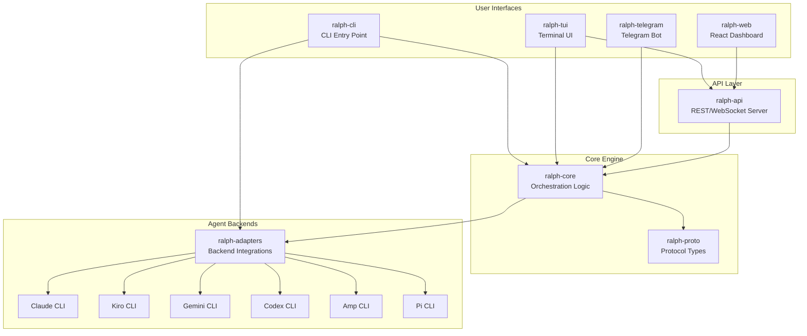
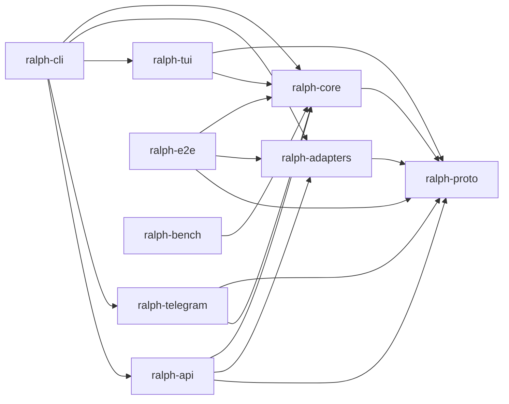
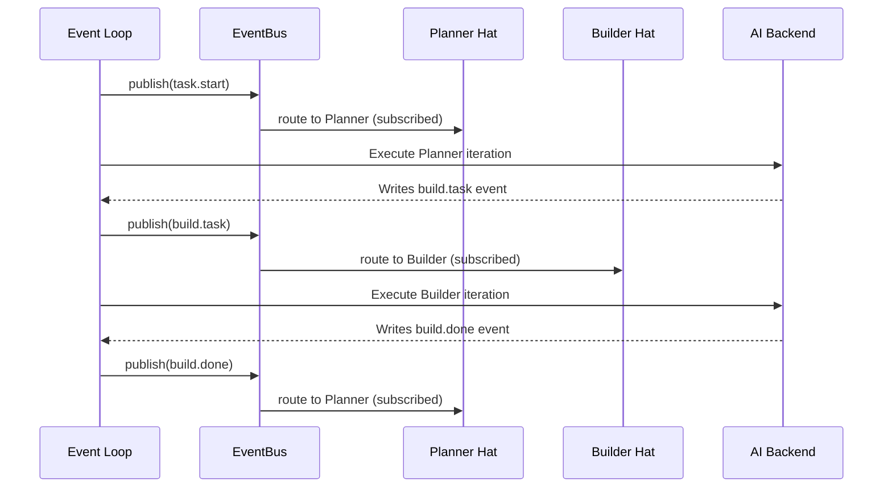

# Architecture

## System Overview

Ralph Orchestrator is a multi-agent orchestration framework that coordinates AI coding assistants (Claude, Kiro, Gemini, Codex, Amp, Pi) through an event-driven loop. The system uses a "hat" metaphor where different agent personas (hats) handle different phases of work, coordinated via pub/sub messaging.

## Crate Dependency Graph

## Core Architectural Patterns

### 1. Event-Driven Orchestration

The central architectural pattern is a pub/sub event bus. Each iteration of the loop:
1. An agent (wearing a "hat") executes a task
2. The agent writes events to a JSONL file (`.ralph/events.jsonl`)
3. The event loop parses events and publishes them on the `EventBus`
4. The `EventBus` routes events to subscribed hats based on topic patterns
5. The next hat with pending events is activated

### 2. Hat System (Agent Personas)

Hats define how an AI agent behaves for a given iteration. Each hat has:
- **Subscriptions**: Topic patterns it responds to (e.g., `build.task`)
- **Publishes**: Topics it emits (e.g., `build.done`, `build.blocked`)
- **Instructions**: Prompt content injected for the hat's iterations
- **Backend**: Which AI CLI to use (can differ per hat)

The default topology is Planner → Builder:
- **Planner**: Subscribes to `task.start`, `task.resume`, `build.done`, `build.blocked`; publishes `build.task`
- **Builder**: Subscribes to `build.task`; publishes `build.done`, `build.blocked`

Custom hats are defined in YAML configuration and can create arbitrary workflows.

### 3. Hatless Ralph (Coordinator)

Ralph is the constant coordinator — always present, cannot be configured away. Ralph:
- Handles `task.start` and `task.resume` (reserved events)
- Performs gap analysis and planning
- Delegates to custom hats via events
- Acts as fallback handler for unrouted events (global wildcard `*` subscriber)
- Builds the prompt including guardrails, memories, skills, and hat-specific instructions

### 4. Topic-Based Routing

Topics are dot-separated strings with glob pattern matching:
- Exact match: `build.done` matches `build.done`
- Wildcard suffix: `impl.*` matches `impl.done`, `impl.started`
- Wildcard prefix: `*.done` matches `build.done`, `review.done`
- Global wildcard: `*` matches everything (fallback priority)

Routing priority: specific subscriptions > fallback wildcards.

### 5. Parallel Loops via Git Worktrees

When the primary loop lock is held, Ralph spawns parallel loops in git worktrees:
- Primary loop holds `.ralph/loop.lock`
- Worktree loops run in `.worktrees/<loop-id>/`
- Shared state: memories, specs, and code tasks are symlinked from main repo
- Merge queue: completed worktree loops queue for merge via `.ralph/merge-queue.jsonl`

### 6. Disk-as-State, Git-as-Memory

Per the Ralph Tenets, persistent state lives on disk:
- `.ralph/agent/memories.md` — persistent learning across sessions
- `.ralph/agent/tasks.jsonl` — runtime work tracking
- `.ralph/events.jsonl` — event history for the current loop
- `.ralph/loop.lock` — PID + prompt of the primary loop
- `.ralph/loops.json` — registry of all tracked loops

### 7. Communication Protocols

The system supports multiple communication modes:

| Protocol | Transport | Use Case |
|----------|-----------|----------|
| **CLI** | PTY subprocess | Default agent execution |
| **RPC** | JSON-lines over stdin/stdout | IDE integrations, subprocess TUI |
| **HTTP/WS** | Axum REST + WebSocket | Web dashboard, remote TUI |
| **Telegram** | teloxide bot framework | Human-in-the-loop interaction |

### 8. Backpressure Over Prescription

Rather than prescribing how agents should work, Ralph creates gates that reject bad work:
- Tests, typechecks, builds, lints (via lifecycle hooks)
- LLM-as-judge with binary pass/fail for subjective criteria
- Hooks can `warn`, `block`, or `suspend` the loop on failure

### 9. Fresh Context Is Reliability

Each iteration clears agent context. The orchestrator:
- Re-reads specs, plans, and memories every cycle
- Optimizes for the "smart zone" (40-60% of ~176K usable tokens)
- Never fights to save a plan — regeneration costs one planning loop

## Configuration Architecture

Ralph uses a split configuration model:
1. **Core config** (`ralph.yml`): Backend, event loop settings, features
2. **Hat collections** (`-H builtin:feature` or YAML files): Hat definitions, event metadata
3. **Presets** (`presets/`): Pre-built hat collection YAML files

Configuration supports both v1 (flat) and v2 (nested) formats with automatic normalization.
