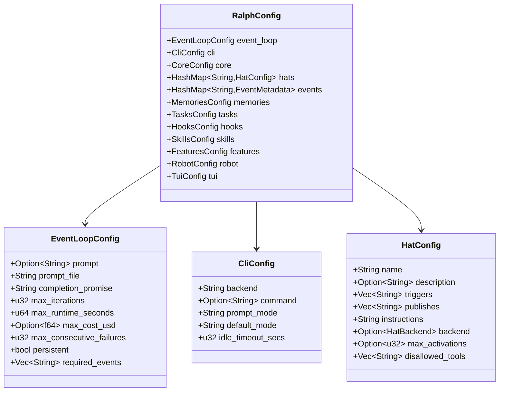

# Data Models

## Core Protocol Types (ralph-proto)

### Event

The fundamental message unit in the pub/sub system.

| Field | Type | Description |
|-------|------|-------------|
| `topic` | `Topic` | Routing key for the event |
| `payload` | `String` | Content/payload of the event |
| `source` | `Option<HatId>` | Hat that published this event |
| `target` | `Option<HatId>` | Direct target hat for handoff |

### Hat

An agent persona that defines behavior for a given iteration.

| Field | Type | Description |
|-------|------|-------------|
| `id` | `HatId` | Unique identifier (e.g., "planner", "builder") |
| `name` | `String` | Human-readable name |
| `description` | `String` | Purpose description (used in HATS table) |
| `subscriptions` | `Vec<Topic>` | Topic patterns this hat responds to |
| `publishes` | `Vec<Topic>` | Topics this hat emits |
| `instructions` | `String` | Prompt content for this hat |

### Topic

A routing key with glob-style pattern matching. Stored as a `String` wrapper.

**Pattern Rules:**
- `*` matches any single segment
- Single `*` matches everything (global wildcard)
- Exact match for non-pattern topics

### HatId

Unique identifier for a hat. Stored as a `String` wrapper with `Display`, `Hash`, `Eq`, `Ord` implementations.

---

## Configuration Types (ralph-core)

### RalphConfig

Top-level configuration supporting both v1 flat and v2 nested formats.



### HatBackend

Backend configuration for a hat (supports multiple formats):

| Variant | Fields | Example |
|---------|--------|---------|
| `Named(String)` | — | `"claude"` |
| `NamedWithArgs` | `type`, `args` | `{ type: claude, args: [--model, opus] }` |
| `KiroAgent` | `type`, `agent`, `args` | `{ type: kiro, agent: reviewer }` |
| `Custom` | `command`, `args` | `{ command: ./my-agent, args: [] }` |

### HooksConfig

| Field | Type | Description |
|-------|------|-------------|
| `enabled` | `bool` | Whether hooks are active |
| `defaults` | `HookDefaults` | Default timeout, output limits, suspend mode |
| `events` | `HashMap<HookPhaseEvent, Vec<HookSpec>>` | Hook specs by lifecycle phase |

### HookSpec

| Field | Type | Description |
|-------|------|-------------|
| `name` | `String` | Stable hook identifier |
| `command` | `Vec<String>` | Command argv form |
| `cwd` | `Option<PathBuf>` | Working directory override |
| `env` | `HashMap<String, String>` | Environment variable overrides |
| `timeout_seconds` | `Option<u64>` | Per-hook timeout override |
| `on_error` | `Option<HookOnError>` | Failure behavior (warn/block/suspend) |
| `mutate` | `HookMutationConfig` | Mutation policy (opt-in JSON payloads) |

---

## Runtime Data Models (ralph-core)

### Task

Runtime work tracking item with JSONL persistence.

| Field | Type | Description |
|-------|------|-------------|
| `id` | `String` | Unique ID: `task-{unix_timestamp}-{4_hex}` |
| `title` | `String` | Short description |
| `description` | `Option<String>` | Detailed description |
| `status` | `TaskStatus` | Open, InProgress, Closed, Failed |
| `priority` | `u8` | 1-5 (1 = highest) |
| `blocked_by` | `Vec<String>` | Task IDs that must complete first |
| `loop_id` | `Option<String>` | Owning loop ID for multi-loop filtering |
| `created` | `String` | ISO 8601 timestamp |
| `closed` | `Option<String>` | ISO 8601 completion timestamp |

### TaskStatus

```
Open → InProgress → Closed
                  → Failed
```

Terminal statuses: `Closed`, `Failed`.

### Memory

Persistent learning entry stored in markdown.

| Field | Type | Description |
|-------|------|-------------|
| `memory_type` | `MemoryType` | Pattern, Decision, Fix, or Context |
| `content` | `String` | The memory content |
| `tags` | `Vec<String>` | Classification tags |
| `timestamp` | `String` | ISO 8601 creation time |

### MemoryType

| Type | Section Header | Emoji | Purpose |
|------|---------------|-------|---------|
| `Pattern` | `## Patterns` | 🔄 | How this codebase does things |
| `Decision` | `## Decisions` | ⚖️ | Why something was chosen |
| `Fix` | `## Fixes` | 🔧 | Solution to a recurring problem |
| `Context` | `## Context` | 📍 | Project-specific knowledge |

---

## Loop & Coordination Models

### LoopContext

Tracks whether the current loop is primary or running in a worktree.

| Variant | Fields |
|---------|--------|
| Primary | `workspace: PathBuf` |
| Worktree | `loop_id: String`, `workspace: PathBuf`, `repo_root: PathBuf` |

### LoopEntry

Registry entry for a tracked loop.

| Field | Type | Description |
|-------|------|-------------|
| `id` | `String` | Loop identifier |
| `prompt` | `String` | Prompt summary |
| `worktree` | `Option<String>` | Worktree path (if parallel) |
| `workspace` | `String` | Working directory |

### MergeEntry

Event-sourced entry in the merge queue.

| Field | Type | Description |
|-------|------|-------------|
| `loop_id` | `String` | Loop that completed |
| `branch` | `String` | Git branch to merge |
| `state` | `MergeState` | Queued, Merged, Failed, Skipped |

### LockMetadata

Contents of `.ralph/loop.lock`.

| Field | Type | Description |
|-------|------|-------------|
| `pid` | `u32` | Process ID holding the lock |
| `prompt` | `String` | Summary of what's running |
| `started` | `String` | ISO 8601 start time |

---

## RPC State Types (ralph-proto)

### RpcState

Snapshot of loop state returned by `get_state`.

| Field | Type | Description |
|-------|------|-------------|
| `iteration` | `u32` | Current iteration number |
| `max_iterations` | `Option<u32>` | Configured limit |
| `hat` / `hat_display` | `String` | Current hat ID and display name |
| `backend` | `String` | Active backend |
| `completed` | `bool` | Whether loop has finished |
| `task_counts` | `RpcTaskCounts` | Total/open/closed/ready counts |
| `active_task` | `Option<RpcTaskSummary>` | Currently active task |
| `total_cost_usd` | `f64` | Cumulative cost |

### TerminationReason

| Reason | Exit Code | Description |
|--------|-----------|-------------|
| `Completed` | 0 | Completion promise detected |
| `MaxIterations` | 2 | Iteration limit reached |
| `MaxRuntime` | 2 | Time limit exceeded |
| `MaxCost` | 2 | Cost limit exceeded |
| `ConsecutiveFailures` | 1 | Too many failures |
| `LoopThrashing` | 1 | Repeated blocked events |
| `LoopStale` | 1 | Same topic 3+ times |
| `Interrupted` | 130 | SIGINT/SIGTERM |
| `Cancelled` | 0 | Graceful cancellation |
| `RestartRequested` | 3 | Telegram `/restart` |

---

## UX Event Types (ralph-proto)

Events for terminal/TUI capture and replay:

| Variant | Key Fields | Purpose |
|---------|-----------|---------|
| `TerminalWrite` | `bytes` (base64), `stdout`, `offset_ms` | Raw terminal output |
| `TerminalResize` | `width`, `height`, `offset_ms` | Terminal dimension change |
| `TerminalColorMode` | `mode`, `detected`, `offset_ms` | Color mode detection |
| `TuiFrame` | `frame_id`, `width`, `height`, `cells` | TUI frame capture |

---

## File-Based State

| File | Format | Purpose |
|------|--------|---------|
| `.ralph/agent/memories.md` | Structured Markdown | Persistent learning |
| `.ralph/agent/tasks.jsonl` | JSONL (one Task per line) | Runtime task tracking |
| `.ralph/events.jsonl` | JSONL (Event records) | Event history per loop |
| `.ralph/loop.lock` | JSON (LockMetadata) | Primary loop PID lock |
| `.ralph/loops.json` | JSON (Vec<LoopEntry>) | Loop registry |
| `.ralph/merge-queue.jsonl` | JSONL (MergeEvent) | Event-sourced merge queue |
| `.ralph/telegram-state.json` | JSON (TelegramState) | Telegram bot state |
| `.ralph/agent/scratchpad.md` | Markdown | Legacy shared state (replaced by tasks) |
