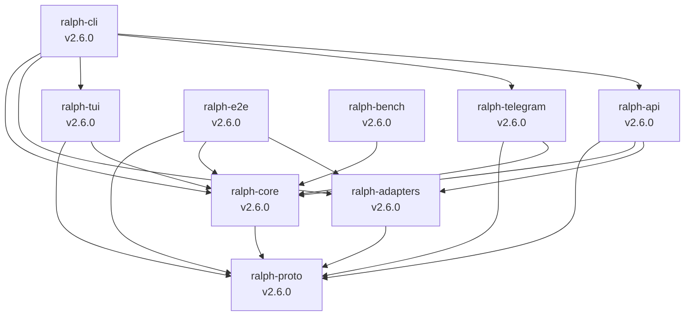

# Dependencies

## Rust Workspace Dependencies

### Async Runtime & Concurrency

| Crate | Version | Purpose |
|-------|---------|---------|
| `tokio` | 1 (full features) | Primary async runtime |
| `async-trait` | 0.1 | Async trait support |
| `futures` | 0.3 | Async stream utilities |
| `tokio-util` | 0.7 (compat) | Tokio compatibility utilities |

### Terminal UI

| Crate | Version | Purpose |
|-------|---------|---------|
| `ratatui` | 0.30 | Terminal UI framework (pinned for rustc 1.87.0) |
| `crossterm` | 0.28 (event-stream) | Terminal manipulation and event handling |
| `termimad` | 0.31 | Terminal markdown rendering |
| `colored` | 3 | Terminal ANSI colors |
| `indicatif` | 0.17 | Progress indicators |

### Serialization

| Crate | Version | Purpose |
|-------|---------|---------|
| `serde` | 1 (derive) | Serialization/deserialization framework |
| `serde_json` | 1 | JSON processing |
| `serde_yaml` | 0.9 | YAML configuration parsing |

### CLI & Input

| Crate | Version | Purpose |
|-------|---------|---------|
| `clap` | 4 (derive, std, cargo) | CLI argument parsing |
| `clap_complete` | 4 | Shell completion generation |

### Networking

| Crate | Version | Purpose |
|-------|---------|---------|
| `reqwest` | 0.12 (rustls-tls, json) | HTTP client for remote presets and APIs |
| `tokio-tungstenite` | 0.24 (rustls-tls-webpki-roots) | WebSocket client |
| `tungstenite` | 0.24 | WebSocket protocol types |

### Error Handling

| Crate | Version | Purpose |
|-------|---------|---------|
| `thiserror` | 2 | Derive macro for custom error types |
| `anyhow` | 1 | Flexible error handling |

### Security

| Crate | Version | Purpose |
|-------|---------|---------|
| `keyring` | 3 (apple-native, linux-native) | OS keychain for credential storage |

### Logging & Tracing

| Crate | Version | Purpose |
|-------|---------|---------|
| `tracing` | 0.1 | Structured logging framework |
| `tracing-subscriber` | 0.3 (env-filter) | Log output and filtering |

### Text Processing

| Crate | Version | Purpose |
|-------|---------|---------|
| `regex` | 1 | Regular expression matching |
| `strip-ansi-escapes` | 0.2 | Strip ANSI escape sequences |

### PTY & Process

| Crate | Version | Purpose |
|-------|---------|---------|
| `portable-pty` | 0.9 | Cross-platform PTY support |
| `nix` | 0.29 (signal, term, fs) | Unix-specific system calls |
| `vt100` | 0.15 | VT100 terminal emulation |
| `scopeguard` | 1 | Scope-based cleanup |

### Date/Time

| Crate | Version | Purpose |
|-------|---------|---------|
| `chrono` | 0.4 (serde) | Date and time handling |

### Bot Framework

| Crate | Version | Purpose |
|-------|---------|---------|
| `teloxide` | 0.13 (macros, rustls, ctrlc_handler) | Telegram bot framework |

### Other

| Crate | Version | Purpose |
|-------|---------|---------|
| `open` | 5 | Open URLs in default browser |
| `tempfile` | 3 | Temporary file creation (testing) |

---

## Internal Crate Dependencies

All internal crates are versioned at `2.6.0` and use path dependencies within the workspace.

---

## Node.js Dependencies

### Backend (@ralph-web/server)

| Package | Purpose |
|---------|---------|
| `fastify` | HTTP server framework |
| `@trpc/server` | Type-safe API layer |
| `better-sqlite3` | SQLite database driver |
| `drizzle-orm` | ORM for SQLite |
| `zod` | Schema validation |
| `ws` | WebSocket support |

### Frontend (@ralph-web/dashboard)

| Package | Purpose |
|---------|---------|
| `react` + `react-dom` | UI framework |
| `vite` | Build tool and dev server |
| `tailwindcss` | Utility-first CSS framework |
| `@trpc/client` + `@trpc/react-query` | Type-safe API client |
| `@tanstack/react-query` | Async state management |
| `reactflow` | Visual graph editor (hat collection builder) |
| `zustand` | State management |
| `lucide-react` | Icon library |

---

## Build & Distribution Tools

| Tool | Version | Purpose |
|------|---------|---------|
| `cargo-dist` | 0.30.3 | Cross-platform binary distribution |
| `npm` | (workspace) | Node.js package management |
| `mkdocs` | — | Documentation site generation |

---

## Workspace Linting Configuration

The workspace enforces strict Rust linting:
- `unsafe_code = "forbid"` — no unsafe code allowed
- `clippy::pedantic` level warnings enabled (with specific allowances for common patterns)
- Multiple `clippy` lints relaxed for ergonomic API design (see `Cargo.toml` workspace lints)
