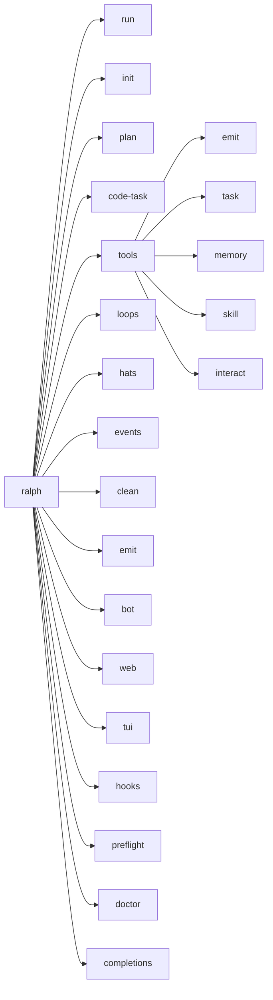

# Interfaces & APIs

## Rust Trait Interfaces

### RobotService (`ralph-proto`)

The core abstraction for human-in-the-loop communication. Implemented by `TelegramService`.

```rust
pub trait RobotService: Send + Sync {
    fn send_question(&self, payload: &str) -> anyhow::Result<i32>;
    fn wait_for_response(&self, events_path: &Path) -> anyhow::Result<Option<String>>;
    fn send_checkin(&self, iteration: u32, elapsed: Duration, context: Option<&CheckinContext>) -> anyhow::Result<i32>;
    fn timeout_secs(&self) -> u64;
    fn shutdown_flag(&self) -> Arc<AtomicBool>;
    fn stop(self: Box<Self>);
}
```

### DaemonAdapter (`ralph-proto`)

Abstraction for persistent bot daemons that listen for messages and start loops on demand.

```rust
#[async_trait]
pub trait DaemonAdapter: Send + Sync {
    async fn run_daemon(&self, workspace_root: PathBuf, start_loop: StartLoopFn) -> anyhow::Result<()>;
}
```

### FrameCapture (`ralph-proto`)

Interface for capturing rendered terminal output for recording/replay.

```rust
pub trait FrameCapture: Send + Sync {
    fn take_captures(&mut self) -> Vec<UxEvent>;
    fn has_captures(&self) -> bool;
}
```

### HookExecutorContract (`ralph-core`)

Interface for executing hook commands, enabling test substitution.

```rust
pub trait HookExecutorContract: Send + Sync {
    fn execute(&self, request: HookRunRequest) -> HookRunResult;
}
```

---

## JSON-RPC Protocol (stdin/stdout)

The RPC protocol enables IPC between the orchestration loop and frontends. Transport is newline-delimited JSON.

### Commands (stdin → Ralph)

| Command | Fields | Purpose |
|---------|--------|---------|
| `prompt` | `prompt`, `backend?`, `max_iterations?` | Start loop with a prompt |
| `guidance` | `message` | Inject guidance for next iteration |
| `steer` | `message` | Steer agent during current iteration |
| `follow_up` | `message` | Queue message for next iteration |
| `abort` | `reason?` | Terminate the loop |
| `get_state` | — | Request state snapshot |
| `get_iterations` | `include_content?` | Request iteration history |
| `set_hat` | `hat` | Force hat change |
| `extension_ui_response` | `request_id`, `response` | Respond to UI prompt |

### Events (Ralph → stdout)

| Event | Key Fields | Purpose |
|-------|-----------|---------|
| `loop_started` | `prompt`, `backend`, `max_iterations` | Loop has begun |
| `iteration_start` | `iteration`, `hat`, `backend` | New iteration beginning |
| `iteration_end` | `iteration`, `duration_ms`, `cost_usd`, tokens | Iteration completed |
| `text_delta` | `iteration`, `delta` | Streaming text from agent |
| `tool_call_start` | `tool_name`, `tool_call_id`, `input` | Tool invocation starting |
| `tool_call_end` | `tool_call_id`, `output`, `is_error` | Tool invocation completed |
| `error` | `code`, `message`, `recoverable` | Error occurred |
| `hat_changed` | `from_hat`, `to_hat`, `reason` | Hat switch |
| `task_status_changed` | `task_id`, `from_status`, `to_status` | Task state change |
| `task_counts_updated` | `total`, `open`, `closed`, `ready` | Task count update |
| `guidance_ack` | `message`, `applies_to` | Guidance received |
| `loop_terminated` | `reason`, `total_iterations`, `total_cost_usd` | Loop ended |
| `orchestration_event` | `topic`, `payload`, `source?`, `target?` | EventBus event |
| `response` | `command`, `success`, `data?`, `error?` | Command response |

---

## CLI Commands



| Command | Description |
|---------|-------------|
| `ralph run` | Run the orchestration loop (default) |
| `ralph init` | Initialize `ralph.yml` configuration |
| `ralph plan` | Start a PDD planning session |
| `ralph code-task` | Generate code task files |
| `ralph tools` | Agent-facing runtime tools |
| `ralph loops` | Manage parallel loops |
| `ralph hats` | Manage configured hats |
| `ralph events` | View event history |
| `ralph clean` | Clean up `.ralph/` artifacts |
| `ralph emit` | Emit events to events file |
| `ralph bot` | Telegram bot management |
| `ralph web` | Launch web dashboard |
| `ralph tui` | Attach TUI to running ralph-api |
| `ralph hooks` | Validate hooks configuration |
| `ralph preflight` | Run environment validation |
| `ralph doctor` | First-run diagnostics |
| `ralph completions` | Generate shell completions |

---

## EventBus Pub/Sub API

The `EventBus` is the central routing mechanism:

```rust
// Register a hat with subscriptions
bus.register(hat);

// Publish an event — returns list of recipient hat IDs
let recipients = bus.publish(event);

// Take pending events for a specific hat
let events = bus.take_pending(&hat_id);

// Human events use a separate queue
let human_events = bus.take_human_pending();

// Observers receive ALL events regardless of routing
bus.add_observer(|event| { /* recording, TUI update */ });
```

**Routing Rules:**
1. Direct target (`event.target`) → route only to that hat
2. Specific subscriptions → route to hats with matching non-wildcard patterns
3. Fallback wildcards → route to hats with global `*` subscriptions
4. Self-routing is allowed (handles LLM non-determinism)
5. `human.*` events go to a separate queue (not routed to hats)

---

## Hook Lifecycle Events

Hooks fire at specific lifecycle points:

| Phase-Event | When |
|-------------|------|
| `pre.loop.start` | Before the orchestration loop begins |
| `post.loop.start` | After the first iteration starts |
| `pre.iteration.start` | Before each iteration |
| `post.iteration.start` | After each iteration begins |
| `pre.plan.created` | Before a plan is created |
| `post.plan.created` | After a plan is created |
| `pre.human.interact` | Before a human interaction event |
| `post.human.interact` | After a human interaction event |
| `pre.loop.complete` | Before loop completion is accepted |
| `post.loop.complete` | After loop completion |
| `pre.loop.error` | Before loop error handling |
| `post.loop.error` | After loop error handling |

Hook failure modes: `warn` (continue), `block` (stop), `suspend` (pause and await recovery).

---

## REST/WebSocket API (ralph-api)

The Axum-based API server exposes:

| Domain | Endpoints |
|--------|-----------|
| **Loop** | Start, stop, get state, guidance, steer |
| **Task** | CRUD operations on runtime tasks |
| **Planning** | PDD session management |
| **Presets** | Browse builtin hat collections |
| **Config** | Configuration management |
| **Collections** | Hat collection CRUD |
| **Stream** | WebSocket event streaming (real-time) |
| **Auth** | Token-based authentication |

---

## Telegram Bot Commands

| Command | Direction | Purpose |
|---------|-----------|---------|
| `human.interact` | Agent → Human | Agent asks a question (loop blocks) |
| `human.response` | Human → Agent | Reply to a question |
| `human.guidance` | Human → Agent | Proactive guidance |
| `/start` | Human → Bot | Initialize bot, store chat ID |
| `/status` | Human → Bot | Get current loop status |
| `/restart` | Human → Bot | Request loop restart |
| `/stop` | Human → Bot | Request loop termination |
