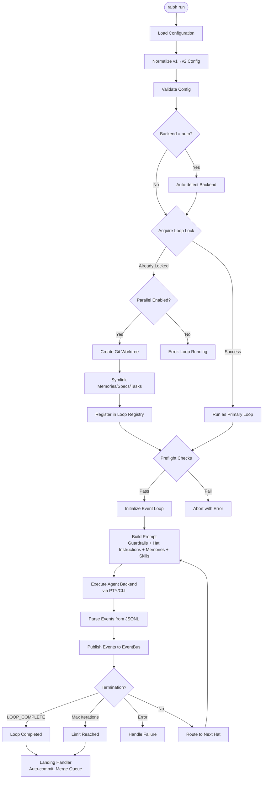
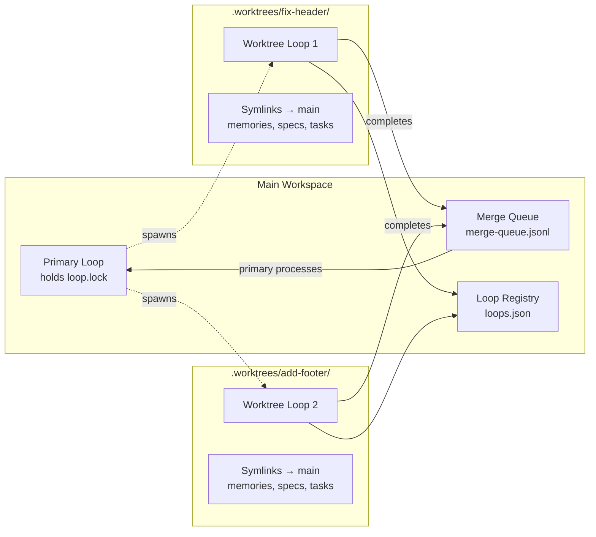
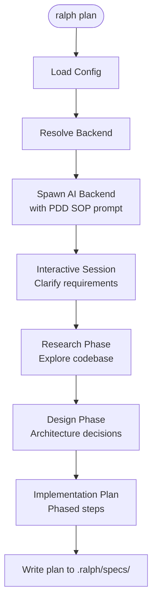
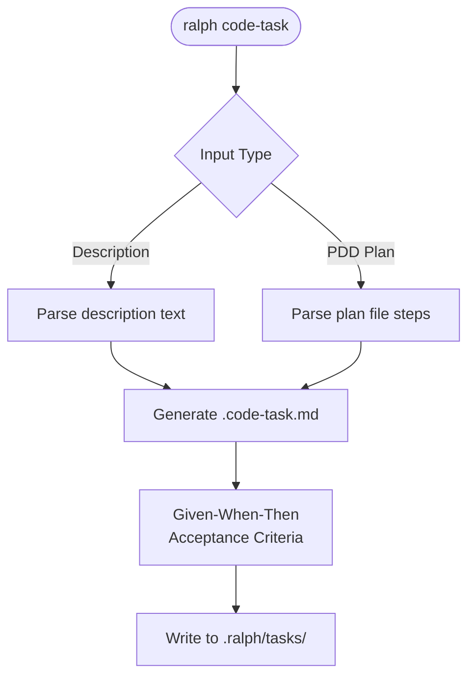
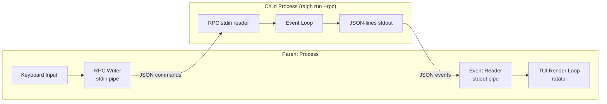
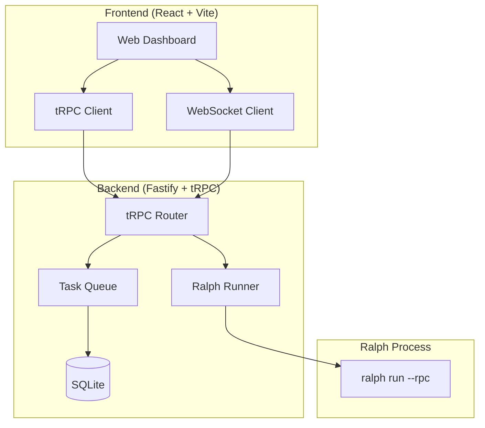
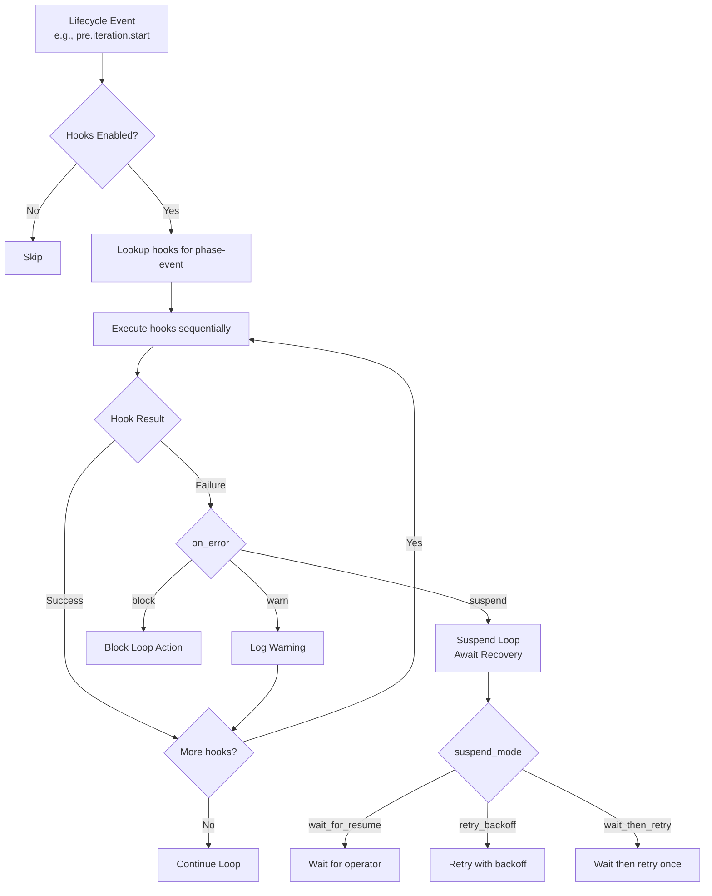
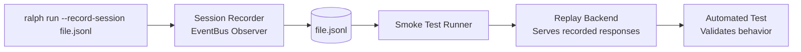

# Workflows

## Primary Orchestration Loop

The main workflow executed by `ralph run`:



## Event Loop Iteration Cycle

Detail of a single iteration within the loop:

```mermaid
sequenceDiagram
    participant Loop as Event Loop
    participant HR as HatlessRalph
    participant HE as Hook Engine
    participant Agent as AI Backend
    participant EB as EventBus
    participant TS as TaskStore
    participant MS as MemoryStore

    Note over Loop: Iteration N begins
    
    Loop->>HE: pre.iteration.start hooks
    HE-->>Loop: OK / Block / Suspend
    
    Loop->>MS: Load memories (if auto-inject)
    Loop->>TS: Load task status
    Loop->>HR: Build prompt (guardrails + hat + memories + skills + tasks)
    HR-->>Loop: Complete prompt string
    
    Loop->>Agent: Execute iteration (PTY/CLI)
    Agent-->>Loop: Agent output + events.jsonl
    
    Loop->>Loop: Parse JSONL events
    Loop->>EB: Publish parsed events
    
    alt human.interact event
        Loop->>Loop: Send question via RObot
        Loop->>Loop: Block waiting for response
    end
    
    EB-->>Loop: Route events to hat queues
    Loop->>Loop: Check termination conditions
    
    alt Completion Promise detected
        Loop->>HE: pre.loop.complete hooks
        Loop->>Loop: Verify required_events seen
        Loop-->>Loop: Terminate (exit 0)
    else Has pending events
        Loop->>Loop: Select next hat
        Note over Loop: Iteration N+1
    else No events, no completion
        Loop->>Loop: Continue with Ralph (fallback)
    end
```

## Parallel Loop Workflow



## Telegram Human-in-the-Loop Flow

```mermaid
sequenceDiagram
    participant Agent as AI Agent
    participant Loop as Event Loop
    participant Bot as Telegram Bot
    participant Human as Human (Telegram)

    Note over Agent: Agent encounters ambiguity
    Agent->>Loop: Emit human.interact event
    Loop->>Bot: Send question via Telegram
    Bot->>Human: "❓ Agent asks: ..."
    
    Loop->>Loop: Block (wait for response or timeout)
    
    Human->>Bot: Reply with answer
    Bot->>Loop: Write human.response to events.jsonl
    Loop->>Agent: Inject response into next iteration
    
    Note over Human: Proactive guidance
    Human->>Bot: Send message without question
    Bot->>Loop: Write human.guidance to events.jsonl
    Loop->>Agent: Inject as "## ROBOT GUIDANCE" in prompt
```

## PDD Planning Session



## Code Task Generation



## Subprocess TUI Mode

The default execution mode spawns a two-process architecture:



## Web Dashboard Workflow



## Hook Execution Flow



## Session Recording & Replay


