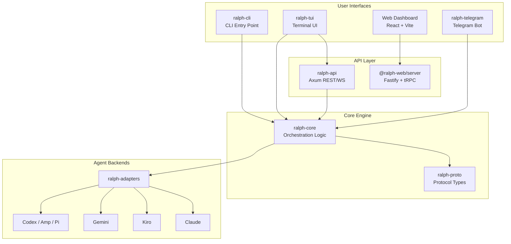
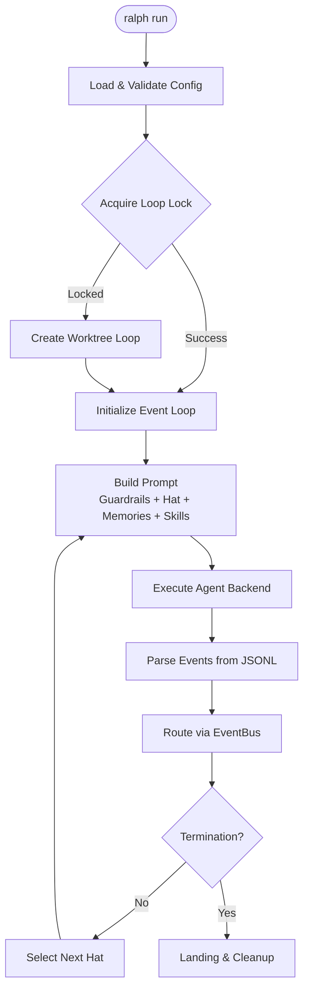
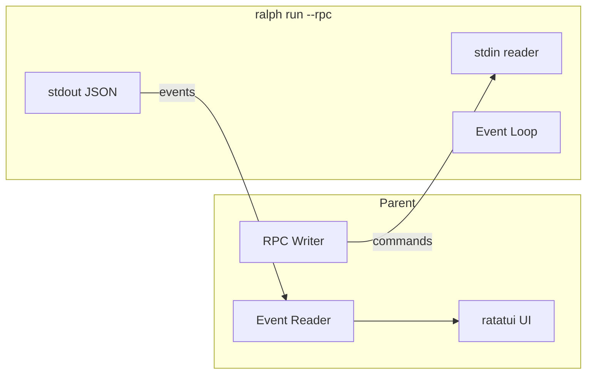

# Ralph Orchestrator — Codebase Summary

> Multi-agent orchestration framework for AI coding assistants.
> Version 2.6.0 | Rust + TypeScript | MIT License

---

## Table of Contents

- [Project Overview](#project-overview)
- [Architecture](#architecture)
- [Workspace Structure](#workspace-structure)
- [Crate & Package Guide](#crate--package-guide)
- [Core Concepts](#core-concepts)
- [Interfaces & Protocols](#interfaces--protocols)
- [Data Models](#data-models)
- [Key Workflows](#key-workflows)
- [Configuration](#configuration)
- [Testing](#testing)
- [Detailed Documentation](#detailed-documentation)

---

## Project Overview

Ralph Orchestrator coordinates AI coding assistants (Claude, Kiro, Gemini, Codex, Amp, Pi) through an event-driven loop. Agents wear "hats" (personas) that define their behavior, and communicate via a pub/sub event bus with topic-based routing.

| Attribute | Value |
|-----------|-------|
| **Repository** | https://github.com/mikeyobrien/ralph-orchestrator |
| **Primary Language** | Rust (215 source files, 9 crates) |
| **Web Backend** | TypeScript/Node.js — Fastify + tRPC + SQLite (58 files) |
| **Web Frontend** | TypeScript/React — Vite + TailwindCSS (70 files) |
| **Platforms** | macOS (aarch64/x86_64), Linux (aarch64/x86_64) |
| **Rust Edition** | 2024 |
| **Node.js** | ≥ 22.0.0 |

---

## Architecture



### Design Principles (The Ralph Tenets)

1. **Fresh Context Is Reliability** — Each iteration clears context. Re-read specs, plan, code every cycle.
2. **Backpressure Over Prescription** — Don't prescribe how; create gates that reject bad work (tests, typechecks, lints).
3. **The Plan Is Disposable** — Regeneration costs one planning loop.
4. **Disk Is State, Git Is Memory** — Memories and Tasks are the handoff mechanisms.
5. **Steer With Signals, Not Scripts** — The codebase is the instruction manual.
6. **Let Ralph Ralph** — Sit *on* the loop, not *in* it.

---

## Workspace Structure

```
ralph-orchestrator/
├── crates/                 # Rust workspace (9 crates)
│   ├── ralph-proto/        # Protocol definitions, shared types, traits
│   ├── ralph-core/         # Event loop, hats, memories, tasks, hooks, coordination
│   ├── ralph-adapters/     # Backend integrations (Claude, Kiro, Gemini, etc.)
│   ├── ralph-cli/          # CLI entry point, all user-facing commands
│   ├── ralph-tui/          # Terminal UI (ratatui-based, 3 operating modes)
│   ├── ralph-telegram/     # Telegram bot for human-in-the-loop
│   ├── ralph-api/          # REST/WebSocket API server (Axum)
│   ├── ralph-e2e/          # End-to-end test framework
│   └── ralph-bench/        # Benchmarking
├── backend/ralph-web-server/  # @ralph-web/server (Fastify + tRPC + SQLite)
├── frontend/ralph-web/        # @ralph-web/dashboard (React + Vite + TailwindCSS)
├── presets/                # Hat collection YAML presets
├── cassettes/              # Replay fixtures for smoke/E2E tests
├── docs/                   # MkDocs documentation site
├── scripts/                # Build and CI helpers
└── .ralph/                 # Runtime state directory
    ├── agent/memories.md   # Persistent learning
    ├── agent/tasks.jsonl   # Runtime task tracking
    ├── events.jsonl        # Event history
    ├── loop.lock           # Primary loop PID lock
    ├── loops.json          # Loop registry
    └── merge-queue.jsonl   # Worktree merge queue
```

---

## Crate & Package Guide

### ralph-proto — Protocol Definitions

Foundational types used across all crates: [`Event`](crates/ralph-proto/src/event.rs), [`EventBus`](crates/ralph-proto/src/event_bus.rs), [`Hat`](crates/ralph-proto/src/hat.rs), [`Topic`](crates/ralph-proto/src/topic.rs), [`RpcCommand`/`RpcEvent`](crates/ralph-proto/src/json_rpc.rs), [`RobotService`](crates/ralph-proto/src/robot.rs) trait, [`DaemonAdapter`](crates/ralph-proto/src/daemon.rs) trait, [`UxEvent`](crates/ralph-proto/src/ux_event.rs).

### ralph-core — Orchestration Engine

The largest crate, containing:
- **Event Loop** ([`event_loop/mod.rs`](crates/ralph-core/src/event_loop/mod.rs)): Main orchestration loop
- **HatlessRalph** ([`hatless_ralph.rs`](crates/ralph-core/src/hatless_ralph.rs)): Constant coordinator, prompt builder
- **Configuration** ([`config.rs`](crates/ralph-core/src/config.rs)): Full config model with v1/v2 support
- **Memory System** ([`memory.rs`](crates/ralph-core/src/memory.rs), [`memory_store.rs`](crates/ralph-core/src/memory_store.rs)): Persistent learning in markdown
- **Task System** ([`task.rs`](crates/ralph-core/src/task.rs), [`task_store.rs`](crates/ralph-core/src/task_store.rs)): JSONL-based work tracking
- **Hooks** ([`hooks/`](crates/ralph-core/src/hooks/)): Lifecycle event handlers with warn/block/suspend
- **Skills** ([`skill.rs`](crates/ralph-core/src/skill.rs), [`skill_registry.rs`](crates/ralph-core/src/skill_registry.rs)): Skill discovery and injection
- **Parallel Loops** ([`worktree.rs`](crates/ralph-core/src/worktree.rs), [`loop_lock.rs`](crates/ralph-core/src/loop_lock.rs), [`merge_queue.rs`](crates/ralph-core/src/merge_queue.rs)): Git worktree coordination
- **Diagnostics** ([`diagnostics/`](crates/ralph-core/src/diagnostics/)): Agent output, orchestration, error, performance collectors

### ralph-adapters — Backend Integrations

Executes AI coding assistants: [`CliBackend`](crates/ralph-adapters/src/cli_backend.rs) (command construction), [`CliExecutor`](crates/ralph-adapters/src/cli_executor.rs) (output capture), [`PtyExecutor`](crates/ralph-adapters/src/pty_executor.rs) (PTY-based execution), [`auto_detect`](crates/ralph-adapters/src/auto_detect.rs) (PATH scanning), stream parsers for Claude and Pi protocols.

### ralph-cli — CLI Entry Point

All user-facing commands: `run`, `init`, `plan`, `code-task`, `tools`, `loops`, `hats`, `events`, `clean`, `emit`, `bot`, `web`, `tui`, `hooks`, `preflight`, `doctor`, `completions`. Implements subprocess TUI mode (two-process architecture).

### ralph-tui — Terminal UI

Three operating modes: in-process (EventBus observer), RPC client (HTTP/WS to ralph-api), subprocess RPC (JSON-lines over stdin/stdout). Built with ratatui + crossterm.

### ralph-telegram — Telegram Bot

Bidirectional human-in-the-loop: `human.interact` (agent asks question, loop blocks), `human.response` (human replies), `human.guidance` (proactive guidance). Implements `RobotService` trait via `TelegramService`.

### ralph-api — REST/WebSocket Server

Axum-based API with domains: loop management, task CRUD, planning sessions, preset browsing, configuration, hat collections, real-time event streaming.

### @ralph-web/server — Node.js Backend

Fastify + tRPC + SQLite: task queue with persistent storage, Ralph process supervision, event parsing, log streaming, config merging.

### @ralph-web/dashboard — React Frontend

Task management, visual hat collection builder (React Flow), PDD planning UI, loop monitoring with WebSocket updates.

---

## Core Concepts

### Event-Driven Orchestration

The `EventBus` routes events between hats using topic-based pub/sub:
1. Agent writes events to `.ralph/events.jsonl`
2. Event loop parses and publishes events
3. `EventBus` routes to subscribed hats (specific patterns > wildcard fallbacks)
4. Next hat with pending events is activated

### Hat System

Hats define agent behavior per iteration. Default topology: **Planner** (subscribes: `task.start`, `build.done`, `build.blocked`; publishes: `build.task`) → **Builder** (subscribes: `build.task`; publishes: `build.done`, `build.blocked`). Custom hats are defined in YAML with triggers, publications, instructions, and optional per-hat backends.

### Parallel Loops

When the primary loop lock is held, Ralph spawns parallel loops in git worktrees (`.worktrees/<loop-id>/`). Shared state (memories, specs, tasks) is symlinked. Completed loops queue for merge via `.ralph/merge-queue.jsonl`.

### Hook Lifecycle

Hooks fire at 12 lifecycle points (pre/post for: loop.start, iteration.start, plan.created, human.interact, loop.complete, loop.error). Failure modes: `warn` (continue), `block` (stop), `suspend` (pause and await recovery).

---

## Interfaces & Protocols

### JSON-RPC Protocol (stdin/stdout)

Newline-delimited JSON for IPC between loop and frontends.

**Commands** (stdin → Ralph): `prompt`, `guidance`, `steer`, `follow_up`, `abort`, `get_state`, `get_iterations`, `set_hat`, `extension_ui_response`

**Events** (Ralph → stdout): `loop_started`, `iteration_start`, `iteration_end`, `text_delta`, `tool_call_start`, `tool_call_end`, `error`, `hat_changed`, `task_status_changed`, `task_counts_updated`, `guidance_ack`, `loop_terminated`, `orchestration_event`, `response`

### Key Rust Traits

- **`RobotService`** (`ralph-proto`): Human-in-the-loop communication (send question, wait response, send checkin)
- **`DaemonAdapter`** (`ralph-proto`): Persistent bot daemon (run_daemon)
- **`FrameCapture`** (`ralph-proto`): Terminal output capture for recording/replay
- **`HookExecutorContract`** (`ralph-core`): Hook command execution

### EventBus Routing Rules

1. Direct target → route only to that hat
2. Specific subscriptions → route to matching non-wildcard patterns
3. Fallback wildcards → global `*` subscribers
4. Self-routing allowed (handles LLM non-determinism)
5. `human.*` events use separate queue

---

## Data Models

### Core Types

| Type | Location | Purpose |
|------|----------|---------|
| `Event` | `ralph-proto` | Pub/sub message: topic + payload + source + target |
| `Hat` | `ralph-proto` | Agent persona: id, subscriptions, publishes, instructions |
| `Topic` | `ralph-proto` | Routing key with glob patterns |
| `RalphConfig` | `ralph-core` | Full configuration (event_loop, cli, core, hats, hooks, etc.) |
| `Task` | `ralph-core` | Runtime work item: id, title, status, priority, blocked_by |
| `Memory` | `ralph-core` | Persistent learning: type (pattern/decision/fix/context), content, tags |

### File-Based State

| File | Format | Purpose |
|------|--------|---------|
| `.ralph/agent/memories.md` | Structured Markdown | Persistent learning |
| `.ralph/agent/tasks.jsonl` | JSONL | Runtime task tracking |
| `.ralph/events.jsonl` | JSONL | Event history |
| `.ralph/loop.lock` | JSON | Primary loop PID lock |
| `.ralph/loops.json` | JSON | Loop registry |
| `.ralph/merge-queue.jsonl` | JSONL | Merge queue |

### Termination Reasons

| Reason | Exit Code | Description |
|--------|-----------|-------------|
| `Completed` | 0 | LOOP_COMPLETE detected |
| `MaxIterations` | 2 | Iteration limit |
| `MaxRuntime` | 2 | Time limit |
| `MaxCost` | 2 | Cost limit |
| `ConsecutiveFailures` | 1 | Too many failures |
| `Interrupted` | 130 | SIGINT/SIGTERM |

---

## Key Workflows

### Orchestration Loop



### Subprocess TUI Mode (Default)



---

## Configuration

Configuration uses a split model:

1. **Core config** (`ralph.yml`): backend, event loop, features, hooks, memories, tasks
2. **Hat collections** (`-H builtin:feature` or YAML): hat definitions, event metadata

Supports both v1 (flat: `agent: claude`, `max_iterations: 100`) and v2 (nested: `cli.backend`, `event_loop.max_iterations`) formats with automatic normalization.

Key config sections: `event_loop` (iterations, runtime, cost limits, completion_promise), `cli` (backend, prompt_mode), `core` (scratchpad, specs_dir, guardrails), `hats` (custom hat definitions), `hooks` (lifecycle hooks), `memories` (inject mode, budget, filters), `tasks` (enabled), `skills` (directories, overrides), `features` (parallel, auto_merge, preflight), `RObot` (Telegram integration).

---

## Testing

```bash
cargo build                                    # Build all crates
cargo test                                     # Run all tests
cargo test -p ralph-core test_name             # Single test
cargo test -p ralph-core smoke_runner          # Smoke tests (replay-based)
cargo run -p ralph-e2e -- --mock               # E2E tests (CI-safe)
npm run test:server                            # Backend tests
```

- **Unit tests**: Throughout all crates
- **Smoke tests**: Replay-based using recorded JSONL fixtures in `crates/ralph-core/tests/fixtures/`
- **E2E tests**: Full orchestration with mock or live backends, reports in `.e2e-tests/`
- **Session recording**: `ralph run --record-session file.jsonl` captures sessions for replay

---

## Detailed Documentation

For in-depth information, see the `.agents/summary/` directory:

| File | Content |
|------|---------|
| [`.agents/summary/index.md`](.agents/summary/index.md) | Documentation index and quick reference |
| [`.agents/summary/codebase_info.md`](.agents/summary/codebase_info.md) | Project identity, tech stack, platforms |
| [`.agents/summary/architecture.md`](.agents/summary/architecture.md) | System architecture and design patterns |
| [`.agents/summary/components.md`](.agents/summary/components.md) | Every crate, module, and web package |
| [`.agents/summary/interfaces.md`](.agents/summary/interfaces.md) | Traits, RPC protocol, CLI commands, REST API |
| [`.agents/summary/data_models.md`](.agents/summary/data_models.md) | All data structures and file formats |
| [`.agents/summary/workflows.md`](.agents/summary/workflows.md) | End-to-end workflow diagrams |
| [`.agents/summary/dependencies.md`](.agents/summary/dependencies.md) | External and internal dependencies |
| [`.agents/summary/review_notes.md`](.agents/summary/review_notes.md) | Documentation review and gap analysis |
